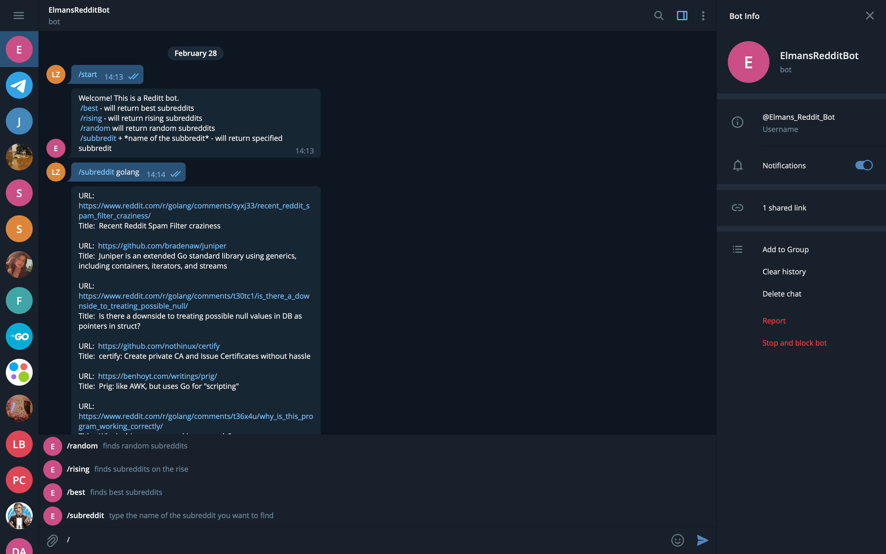

## Reddit Bot Written In Go

> This telegram bot was built to better understand the development of telegram bot applications

## Main learning points:

* working with Telegram API
* learning how to deploy a project to Heroku using heroku git
* how to work with Reddit API

## Dependencies:

*	github.com/go-telegram-bot-api/telegram-bot-api v4.6.4+incompatible
* github.com/technoweenie/multipartstreamer v1.0.1 // indirect


## How To Satrt The Application

```bash 
get your bot credentials using @BotFather
install git and heroku cli
git clone https://github.com/ElmanZ/reddit-bot.git
cd go/src/github.com/<github username>/<project name>
edit TOKEN values and webhook URL
deploy using heroku
```

## Examples
* Find my bot on telegram searching @Elmans_Reddit_Bot

